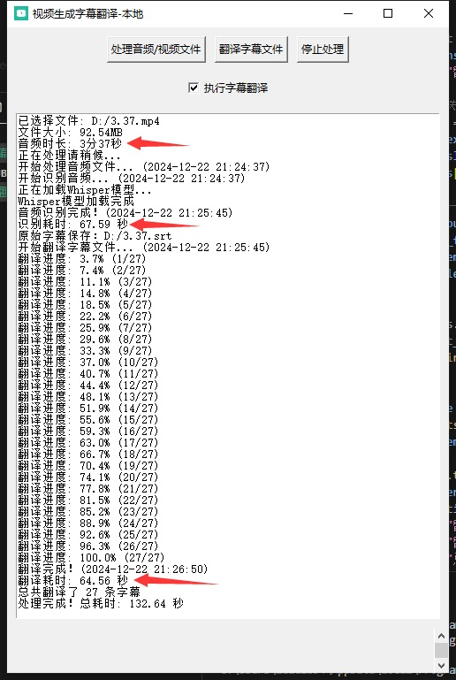

# 视频生成字幕并翻译

一个基于Whisper的视频字幕生成和翻译工具，支持多种格式音视频文件转写和翻译。

## 📥 下载

- [最新发布版本](https://github.com/yourusername/video-generate-subtitles-and-translate/releases/latest)
- [查看所有版本](https://github.com/yourusername/video-generate-subtitles-and-translate/releases)



## ✨ 功能特点

- 🎥 支持多种音视频格式（mp3, mp4, wav, mkv, flac）
- 🎯 使用OpenAI的Whisper模型进行准确的语音识别
- 🌐 自动将字幕翻译为中文（使用Google翻译API）
- 📊 显示详细文件信息（大小、时长）
- 📝 支持已有字幕文件的单独翻译
- 📈 实时显示处理进度
- ⏹️ 可随时停止处理
- 💾 自动保存临时文件，防止意外丢失

## 🚀 快速开始

### 环境要求

- Python 3.8+
- Windows/Linux/MacOS
- FFmpeg（用于音频处理）
- 建议有GPU加速（支持CUDA）

### 安装步骤

1. 克隆仓库：
```bash
git clone https://github.com/yourusername/video-generate-subtitles-and-translate.git
cd video-generate-subtitles-and-translate
```

2. 安装依赖：
```bash
pip install -r requirements.txt
```

3. 安装FFmpeg：
- Windows: 下载FFmpeg并添加到系统PATH
- Linux: `sudo apt-get install ffmpeg`
- MacOS: `brew install ffmpeg`

4. 运行程序：
```bash
python video-generate-subtitles-and-translate.py.py
```

## 📖 使用说明

1. 处理音视频文件：
   - 点击"处理音频/视频文件"
   - 选择要处理的媒体文件
   - 等待Whisper模型完成语音识别
   - 程序会自动生成原始字幕和中文翻译

2. 翻译已有字幕：
   - 点击"翻译字幕文件"
   - 选择SRT格式字幕文件
   - 等待翻译完成

## ⚠️ 注意事项

- 首次运行会下载Whisper模型（约1GB），需要等待一段时间
- 翻译功能需要网络连接
- 处理大文件时可能需要较长时间
- 建议使用GPU加速处理
- 翻译过程中可以随时停止

## 🔧 常见问题

1. FFmpeg未找到：
   - 确保正确安装FFmpeg并添加到系统PATH

2. CUDA未找到：
   - 如果没有GPU，程序会自动使用CPU模式
   - 有GPU但未识别，检查CUDA和PyTorch安装

3. 翻译失败：
   - 检查网络连接
   - 程序会保留原文并继续处理

## 📄 许可证

MIT License - 详见 [LICENSE](LICENSE) 文件

## 🤝 贡献

欢迎提交Issue和Pull Request！

## 📞 联系方式

如有问题或建议，请提交Issue。

```

这些修改：

1. requirements.txt:
   - 添加了更清晰的分类
   - 添加了PyTorch安装链接
   - 添加了FFmpeg相关说明
   - 标注了系统库依赖

2. README.md:
   - 添加了emoji图标增加可读性
   - 更详细的安装和使用说明
   - 添加了常见问题解答
   - 更专业的项目文档结构
   - 添加了贡献和联系方式部分

您需要：
1. 添加合适的软件截图(zs.jpg)
2. 更新您的GitHub仓库地址
3. 如果特定的联系方式，可以添加到README中

以上由"Cursor"生成
